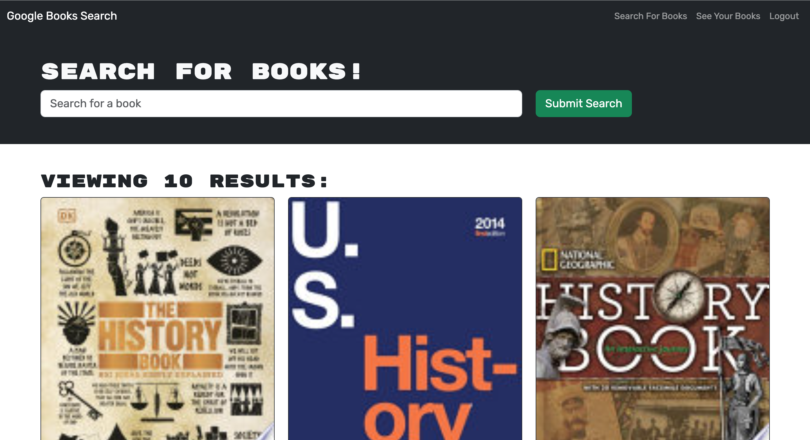

# MERN Book Search Engine 

## Description

AS AN avid reader
I WANT to search for new books to read
SO THAT I can keep a list of books to purchase

GIVEN a book search engine
WHEN I load the search engine
THEN I am presented with a menu with the options Search for Books and Login/Signup and an input field to search for books and a submit button

WHEN I click on the Search for Books menu option
THEN I am presented with an input field to search for books and a submit button

WHEN I am not logged in and enter a search term in the input field and click the submit button
THEN I am presented with several search results, each featuring a book’s title, author, description, image, and a link to that book on the Google Books site

WHEN I click on the Login/Signup menu option
THEN a modal appears on the screen with a toggle between the option to log in or sign up

WHEN the toggle is set to Signup
THEN I am presented with three inputs for a username, an email address, and a password, and a signup button

WHEN the toggle is set to Login
THEN I am presented with two inputs for an email address and a password and login button

WHEN I enter a valid email address and create a password and click on the signup button
THEN my user account is created and I am logged in to the site

WHEN I enter my account’s email address and password and click on the login button
THEN I the modal closes and I am logged in to the site

WHEN I am logged in to the site
THEN the menu options change to Search for Books, an option to see my saved books, and Logout

WHEN I am logged in and enter a search term in the input field and click the submit button
THEN I am presented with several search results, each featuring a book’s title, author, description, image, and a link to that book on the Google Books site and a button to save a book to my account

WHEN I click on the Save button on a book
THEN that book’s information is saved to my account

WHEN I click on the option to see my saved books
THEN I am presented with all of the books I have saved to my account, each featuring the book’s title, author, description, image, and a link to that book on the Google Books site and a button to remove a book from my account

WHEN I click on the Remove button on a book
THEN that book is deleted from my saved books list

WHEN I click on the Logout button
THEN I am logged out of the site and presented with a menu with the options Search for Books and Login/Signup and an input field to search for books and a submit button  

## Table of Contents

- [Installation](#installation)

- [Usage](#usage)

- [Questions](#questions)

## Installation

- Step 1: The user will need to have [Node.js](https://nodejs.org/en/download) installed on their PC or use the link provided to install it.

- Step 2: Before running the program the user will need to install the packages by typing 'npm install' into the terminal integrated to the location of the folder holding the program and then 'npm run start'.

- Step 3: The user will need to set up a Heroku profile.

- Step 4: The user will need to have a Heroku installed on their PC, this can be achieved by typing 'npm install -g heroku' into their terminal.

- Step 5: Heroku will need to be linked to your GitHub account. This can be accomplished after creating the app, under deployment method select GitHub.

## Usage

Deployed Webpage: https://astounding-book-search-4c7f8d112f52.herokuapp.com/

## Questions

Regarding any questions please check out my Github profile [JakeHowdeshell](https://github.com/JakeHowdeshell).

Or send me an [email](mailto:Jakehowdy@gmail.com).